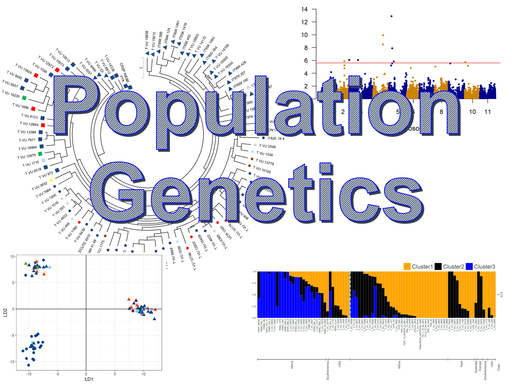

<head>
  <!-- Global site tag (gtag.js) - Google Analytics -->

</head>

<table id="repo-table">
<tbody>
<tr>
    <td id="cover">

      
      
<i class="fa fa-star"></i><b>whereami</b>

      
    
</td>
    <td id="shrynk">

      
      
<i class="fa fa-star"></i><b>shrynk</b>

      
    
</td>
</tr>
</tbody>
</table>

[["https://github.com/rbiology/rbiology.github.io/blob/master/rbiologyimages/rtutorial_cover2.PNG"]](rtutorials)

[["https://github.com/rbiology/rbiology.github.io/blob/master/rbiologyimages/img1_statistics.PNG"]](popentutorials)

</a>

 

[Click here to view the tutorials.](rtutorials.md)

This website was created by [Dev Paudel](https://dpaudel.github.io/) as a part of the [Conviron Scholar](https://aspb.org/awards-funding/aspb-awards/aspb-conviron-scholars-program/) program of the [American Society of Plant Biologists](https://aspb.org/) 2017.

