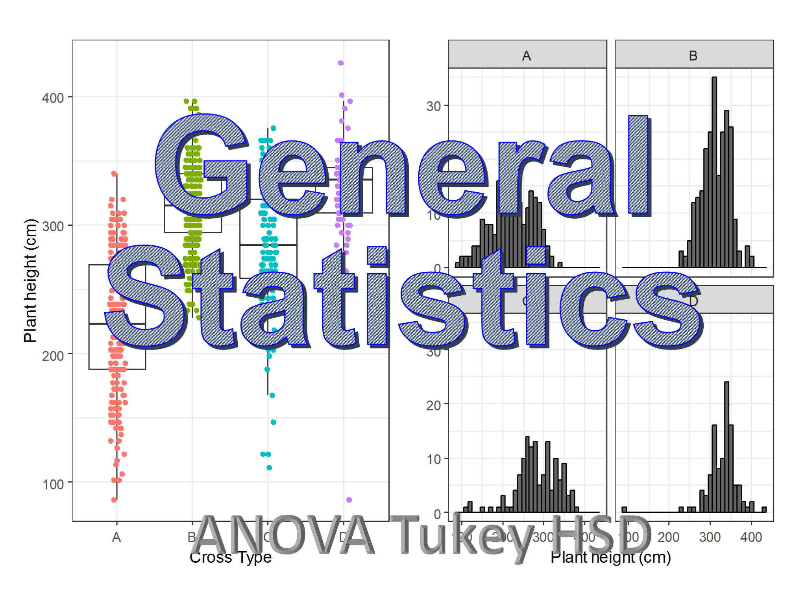

<head>
  <!-- Global site tag (gtag.js) - Google Analytics -->

</head>

[Click to view the tutorials.](rtutorials.md)

(rtutorials.md)

This website was created by [Dev Paudel](https://dpaudel.github.io/) as a part of the [Conviron Scholar](https://aspb.org/awards-funding/aspb-awards/aspb-conviron-scholars-program/) program of the [American Society of Plant Biologists](https://aspb.org/) 2017.
